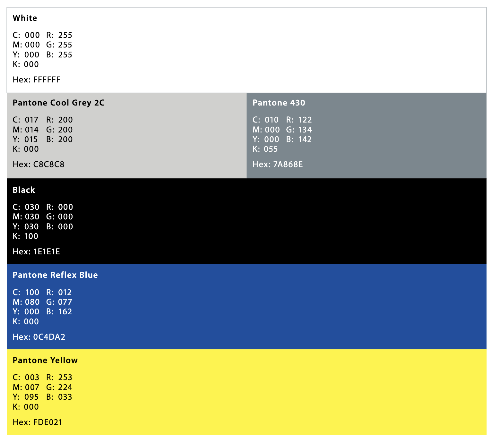
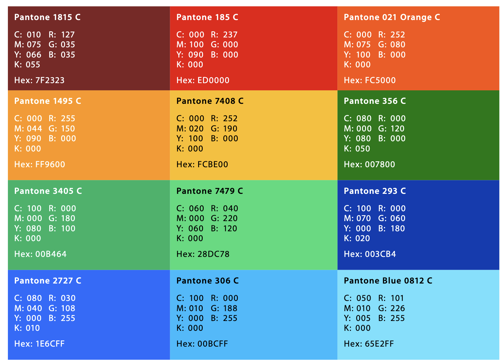

# EP Brand Materials

## Colors

### Primary palette

| Color               | Hex    | 
|---------------------|--------|
|White                | FFFFFF |
|Pantone Cool Grey 2C | C8C8C8 |
|Pantone 430          | 7A868E |
|Black                | 1E1E1E |
|Pantone Reflex Blue  | 0C4DA2 |
|Pantone Yellow       | FDE021 |

### Secondary palette

| Color                 | Hex    | 
|-----------------------|--------|
| Pantone 1815 C        | 7F2323 |
| Pantone 1495 C        | FF9600 |
| Pantone 3405 C        | 00B464 |
| Pantone 2727 C        | 1E6CFF |
| Pantone 185 C         | ED0000 |
| Pantone 7408 C        | FCBE00 |
| Pantone 7479 C        | 28DC78 |
| Pantone 306 C         | 00BCFF |
| Pantone 021 Orange C  | FC5000 |
| Pantone 356 C         | 007800 |
| Pantone 293 C         | 003CB4 |
| Pantone Blue 0812 C   | 65E2FFR |

